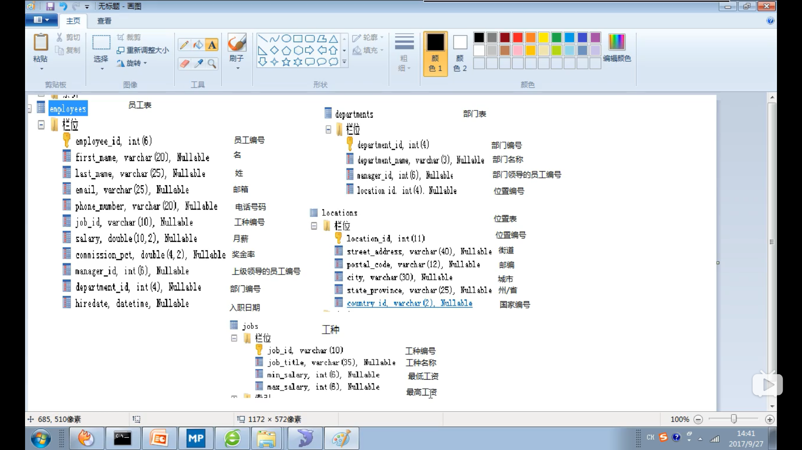

### 查看数据库版本
方法一：登录到mysql服务端
select version();
方式二：没有登录到mysql服务端
mysql --version
或
mysql -V

### mysql的常用命令
1. show databases;//查看所有库  
2. use name(库名);//打开name库  
3. show tables;//查看当前库的所有表  
4. show tables from name(库名);//查看其他库的所有表
5. create tables 表名(
       列名 列类型，
       列名 列类型，
       。。。
   );//创建表  
6. select database();//查看当前所在库  
7. desc name(表名);//查看表结构  
8. select * from name(表名);//查看表是否有数据  

### MYsql 的语法规范
1. 不区分大小写
2. 每条命令最好赢分号结尾
3. 每条命令根据需要，可以进行缩进或换行
4. 注释
   单行注释：#注释文字
   单行注释：-- 注释文字
   多行注释：/*注释文字*/

# DQL语言的学习
* 基础查询  
>语法：  
>select 查询列表 from 表名;  
>特点：  
>1. 查询列表可以是：表中的字段，常量值，表达式，函数  
>2. 查询的结果是一个虚拟的表格

1. 查询表中的单个字段  
   select 查询列表 from 表名;
2. 查询表中的多个字段  
   select 查询列表,查询列表,查询列表 from 表名;
3. 查询表中的所有个字段  
   select * from 表名;
4. 查询常量值  
   select 100;  
   select 'john'
5. 查询表达式  
   select 100%98;
6. 查询函数  
   select version();
7. 起别名  
   方式一：  
   select 100%98 as 结果；  
   方式二：  
   select 100%98 结果；  
   /*如果别名中有空格啥的，最好用单引号括起来*/
8. 去重   
   select distinct 查询列表 from 表名;
9. +号的作用  
   仅仅只有一个功能：运算符  
   select 100+90;   
   两个操作数都为数值型，则做加法运算
   select '123'+90;  
   只要其中一方为字符型，试图将字符型数值转化为数值型  
   如果转换成功，则继续做加法运算  
   select 'john'+90  
   如果转换失败，则将字符型数值转化为0  
   select null+10;  
   只要其中一方为null，则结果肯定为null