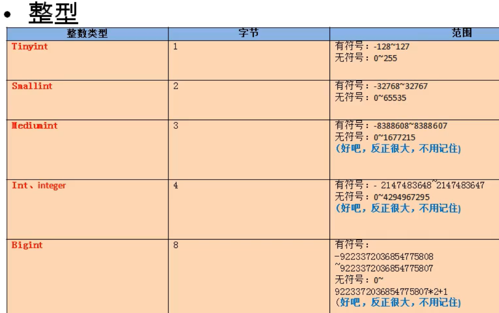
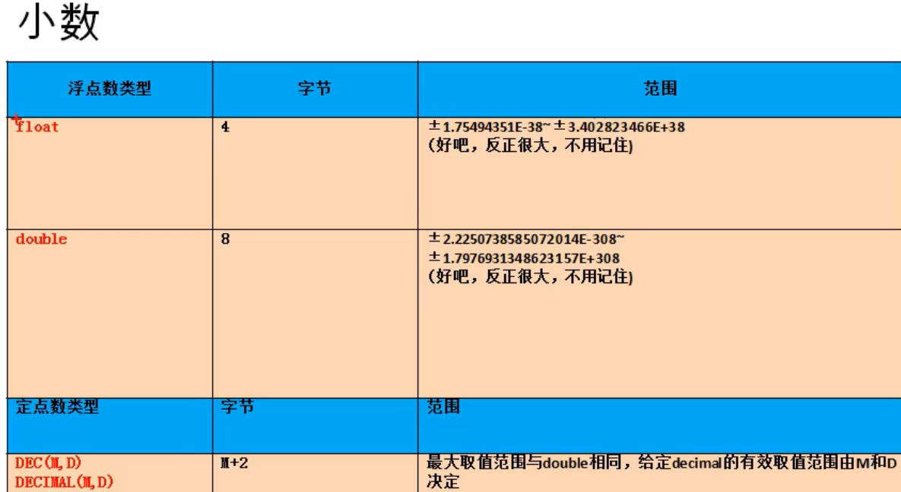
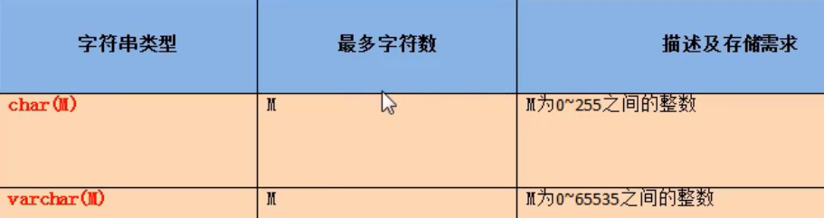
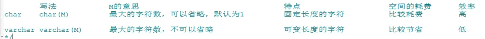
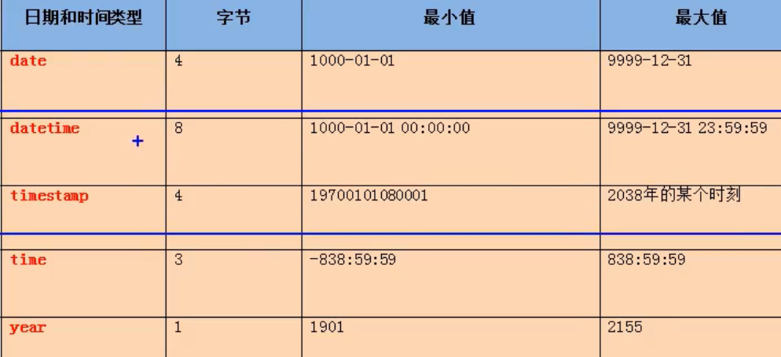
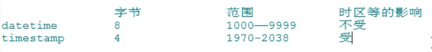

# 常见的数据类型
>数值型：  
>整形  
>小数：定点数，浮点数  
>字符型：  
>较短的文本：char,varchar,binary和varbinary用于保存较短的二进制，enum用于保存枚举，set用于保存集合  
>较长的文本：text，blob(较长的二进制数据)  
>日期型：  

## 1.整形
>如果不设置长度，会有默认的长度，长度代表了显示的最大宽度，如果不够，会用0在左面填充，但必须搭配zerofill使用。

如何设置无符号和有符号  
create table tab_int(  
t1 int,  
t2 int unsingend  
);  
## 2.小数 
>M:整数部位+小数部位    
>D:小数部位    
>如果超过范围，则插入临界值  
>M和D都可以省略  
>如果是decimal,则M默认为10，D默认为0

## 3.字符型

## 4.日期型

