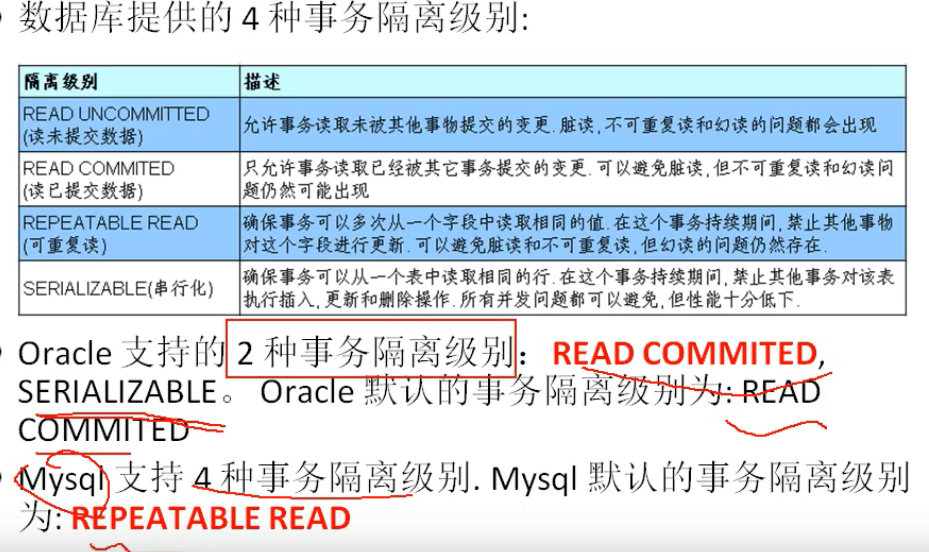

# 事务控制语言：
>事务：一个或一组SQL语句组成一个执行单元，这个执行单元要么全部执行，要么全部不执行。  
>特点：  
1.原子性：一个事务不可再分割，要么都执行要么都不执行  
2.一致性：一个事务执行会试数据从一个一致状态切换到另一个一致状态  
3.隔离性：一个事务不受其他事务的干扰  
>4.持久性：一个事务一旦提交，就会永久的对数据库的数据进行改变  

>事务的创建  
隐式事务：事务没有明显的开启和结束标记  
>比如insert,update,delete语句  
>
显式事务：事务具有明显的开启和结束标记  
前提：必须先设置自动提交功能为禁用  
set autocommit=0;

步骤1：开启事务  
set autocommit=0;  
start transaction;可选的  
步骤2：编写事务中的sql语句（select,insert,update,delete）  
语句1；  
语句2；   
...  
步骤3：结束事务  
commit;提交事务  
rollback;回滚事务  

>并发事务的问题  
对于同时运行的多个事务，当这些事务访问数据库中相同的数据时，如果没有采取必要的隔离机制，
就会导致各种并发问题：  
    脏读：对于两个事务T1，T2。T1读取了已经被T2更新但还没有被提交的字段之后，若T2回滚，
    T1读取的内容就是临时无效的  
    不可重复读：对于两个事务T1，T2。T1读取了一个字段，然后T2更新了该字段之后，T1再次
    读取同一个字段，值就不同了  
    幻读：对于两个事务T1，T2。T1从一个表中读取了一个字段，然后T2在该表中插入了一些
    新的行之后。如果T1再次读取同一个表，就会多几行  

查看当前隔离级别：SELECT @@tx_isolation;  
设置当前会话隔离级别：set transaction isolation level read committed;  
设置数据库系统的全局的隔离级别：set global transaction isolation level read committed;  

mysql默认用第三个隔离级别

#### delete和truncate在事务使用时的区别  
回滚时，delete能，truncate不能。

#### 演示savepoint的使用
>savepoint 节点名;设置保存点  

SET autocommit=0;  
START TRANSACTION;  
DELETE FROM account WHERE id=25;  
SAVEPOINT a;#设置保存点  
DELETE FROM account WHERE id=28;  
ROLLBACK TO a;#回滚到保存点  
