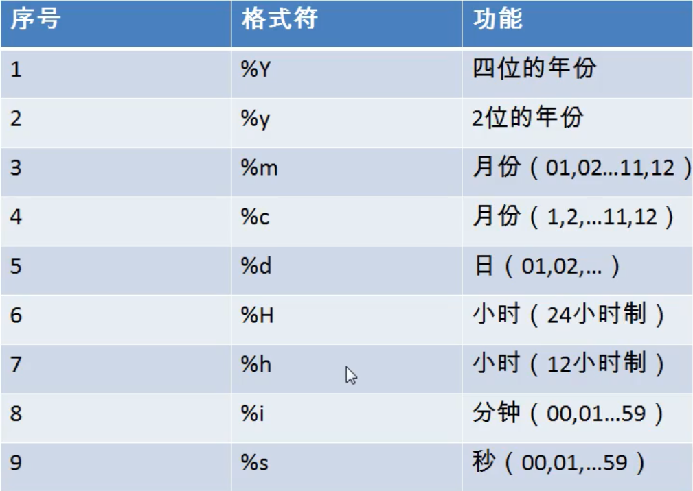

## 常见函数
>优点  
>1，隐藏了实现细节  
>2，提高代码的重用性  
>调用：select 函数名2（实参列表） 【from 表】；  
>特点：  
>1，叫什么    
>2，干什么    
>分类：  
>1，单行函数   
>2，分组函数：统计使用  

### 1.字符函数
#### length 获取参数值得字节个数
select length('john');
#### concat 拼接字符
select concat(lase_name,'_',first_name) 姓名 from employees;    
用_把姓和名拼接起来
#### upper，lower 变大小写

#### substr,substring
注意：索引从1开始  

截取从指定索引处后面所有字符  
select substr('123456789',7) out_put;  
结果：789  
  
截取从指定索引处指定字符长度的字符  
select substr('123456789',1,3) out_put;  
结果：123  
#### instr 返回子串第一次出现的索引，如果找不到返回0
#### trim
select trim('aa' from 'aaaaa张aaaa翠山aaaaa') AS out_put;
结果：a张aaaa翠山a 
去掉前后的aa
#### lpad 用指定的字符实现左填充指定长度
select lpad('殷素素'，10，'*') as out_put;
结果：*******殷素素
#### Rpad 用指定的字符实现右填充指定长度
#### replace 替换
select replace('123123','123','456') as out_put;
结果：456465

## 数学函数
### round 四舍五入
select round(-1.55);//结果是-2  
select round(1.567,2);//小数点后保留两位  
### ceil 向上取整
### floor 向下取整
### truncate 截断
select truncate(1.69999,1);//小数点>1位开始截断
### mod 取余
select mod(-10,-3);//结果的正负与被除数-10有关
## 日期函数
### now 返回当前系统日期+时间
### curdate 返回当前系统日期，不包含时间
### curtime 返回当前系统时间，不包含日期
### 可以获取指定的部分，年，月，日，小时，分钟，秒
select year(now()) 年;  
selecr month(now)) 月；  
### str_to_date:将日期格式的字符转换成指定格式的日期
str_to_date('9-13-1999','%m-%d-%Y')

### date_format:将日期转换成字符
案例：select last_name,date_name(hiredate,'%m月/%d日 %y年' 入职日期  
from employees   
where commission_pct is not null;  
## 其他函数
### select version();  
### select database();  
### select user();
## 流程控制函数
### if函数：if else 的效果
select if(10<5,'大',‘小’)；  
### case函数的使用一:switch case 的效果
select salary 原始工资，department_id,  
case department_id  
when 30 then salary*1.1  
when 40 then salary*1.2  
when 50 then salary*1.3  
else salary  
end as 新工资  
from employees;  
### case函数的使用二:多重if
查询员工的工资的情况  
如果工资>20000，显示A级别  
如果工资>15000，显示B级别  
....  
select salary,  
case  
when salary>20000 then 'A'  
when salary>15000 then 'B'  
when salary>10000 then 'C'  
else 'D'  
end as 工资级别  
from employees;  
  
